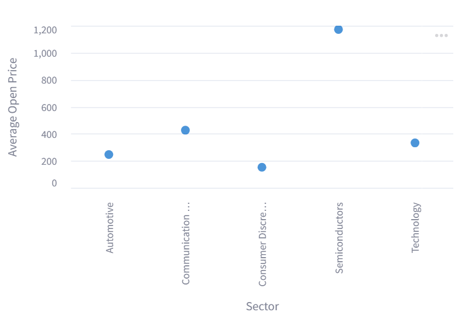
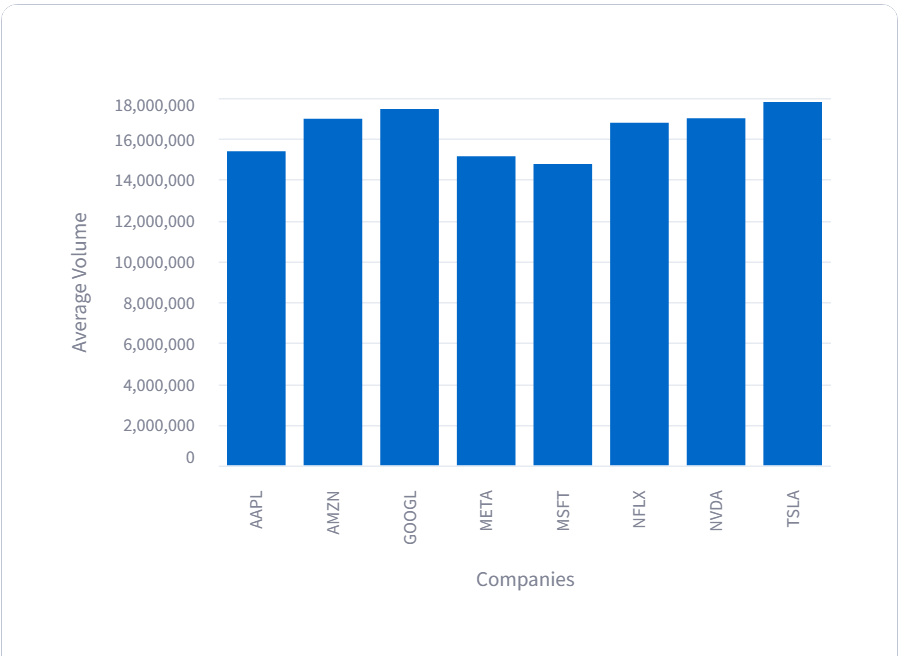
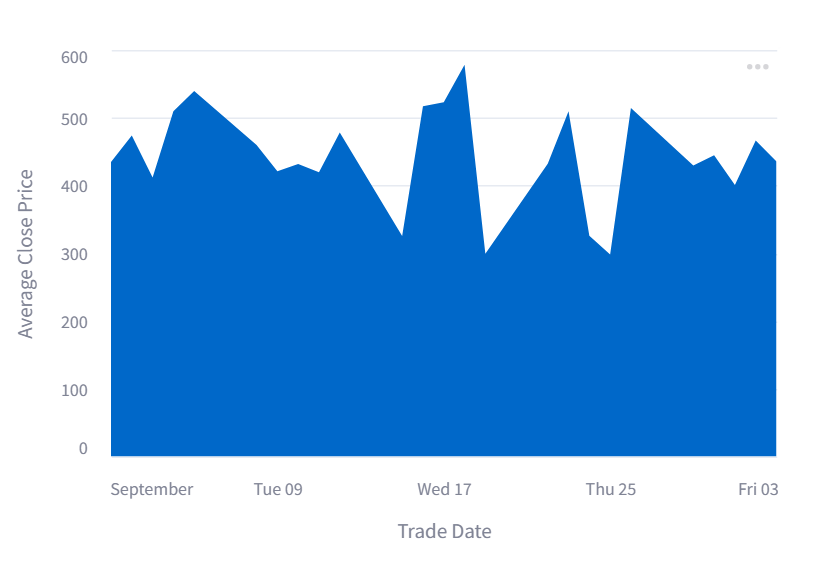

# DataCleaningAndViz

This is my submission for the Data Cleaning & Viz assignment. 

## Instructions

To run the scripts, use `uv run <scriptname.py>`.

The script `app.py` loads the CSV, cleans the data, and writes to `cleaned.parquet`.

The script `analyze.py` reads in `cleaned.parquet`, and computes the following aggregations:
* agg1: the average open price of each sector.
* agg2: the average volume from each ticker. 
* agg3: the average close price on each trade date.

Each of these gets written to its respective parquet file.

## Visuals

These visuals were made by putting code within `app.py` and `analyze.py` into the Streamlit playground, using `import streamlit as st` to create Streamlit graphs.

### Agg 1: Average open price of sectors

### Agg 2: Average volume of tickers

### Agg 3: Average close price of trade dates
